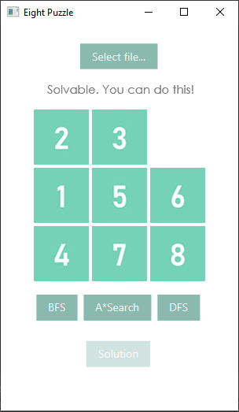
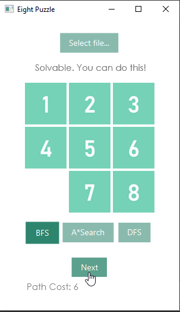
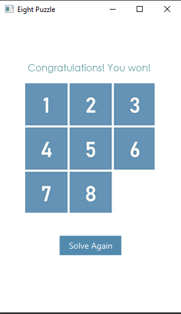

# 8 Puzzle Game with AI
This is the 8 Puzzle Game created with JavaFX. It has an AI implementation of BFS, DFS, and A* search. This is one of my laboratory exercise in my Artificial Intelligence course during my junior year.

